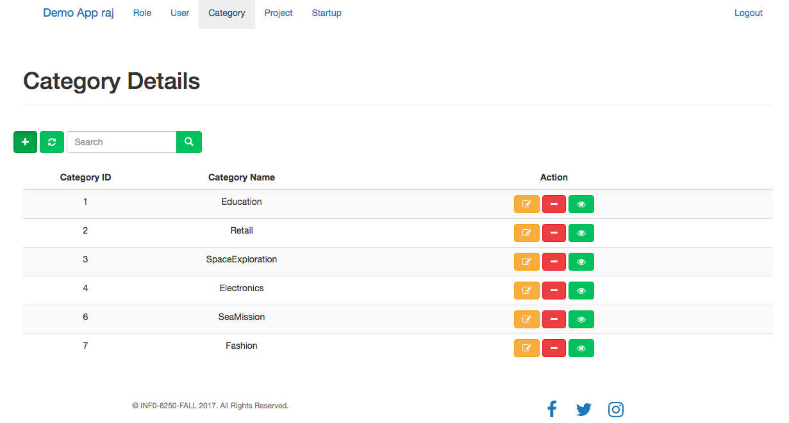

# Crowd Sourcing Website:

Premise: A basic website is designed and developed to market the Startup ideas of their owner to generate revenue to accomplish their task. This website has role base access-

Admin- S/he has complete access of the application.
Creator- Who own the Startup ideas. Has complete access of its investor and their ideas.
Investor-Who if they like startup ideas may fund them.
Guest- Who can only view the ideas and how much crowd souring has made progress.

# Architecture Design:

Three tiers architecture design to develop the application:
1.	Front-end- Angular2
2.	Back-end- Java J2EE Spring Boot framework
3.	Database- MySQL

Server- Tomcat Apache
REST API is designed and developed to consume the data.

# Authentication:

OAuth 2.0 Bearer Token is used to authenticate a request by the server that the request coming from a requesting client. This way the server knows that the application using the bearer token is the same application that the bearer token was created for.

# MySQL DataBase Design:

# Front-End-

User can register through the Register Page:

Based on user role required access is provided.

Admin enter his\her credential at the home page:

Post authenticating details Admin entered the application:

The above page shows the different role types and their corresponding id.

Admin can create/view/delete the Roles as appropriate.

Startup may fall in any one of the following categories.

 

Now, how much a startup has made progress of its funding and its unique idea is shown below:

When a user click on view button to see how much progress has been made it will navigate to the Investor page and can see who has made the contribution for the project.

When a creator login the page s/he has only access to the Project ideas page.

Below page has no access to the Startup creator.

